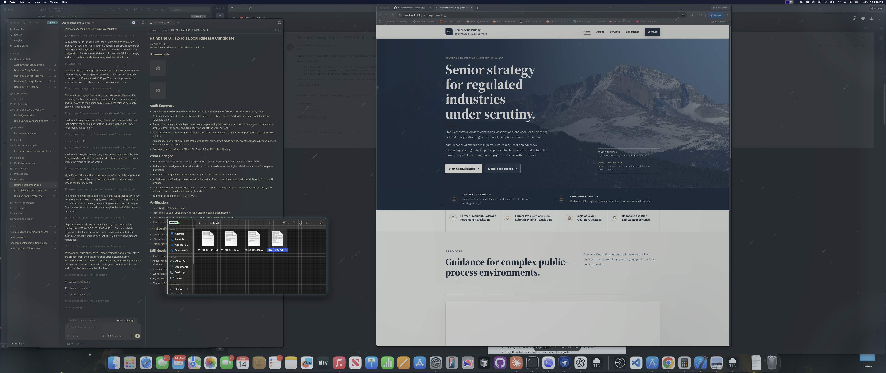
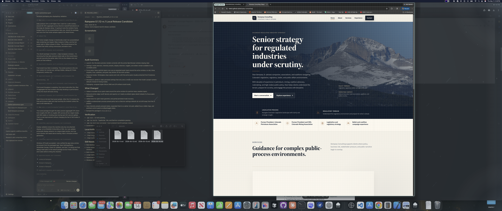
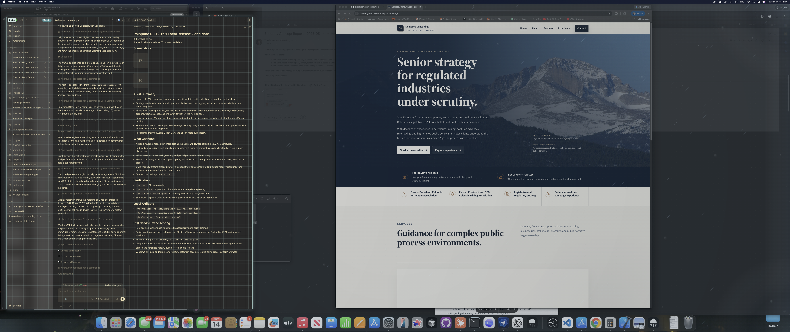

# Rainpane 0.1.12-rc.1 Local Release Candidate

Date: 2026-05-14
Status: local unsigned RC, packaged and launched from `/tmp/rainpane-release/mac-arm64/Rainpane.app`

## Summary

This RC pass focused on making Rainpane feel trustworthy as a quiet daily-use overlay: edge-weighted atmosphere, a protected focus pane, less fragile overlay visibility, and real packaged-app validation instead of only the Vite demo.

The macOS app now builds, launches locally from the packaged `.app`, survives close-to-hide settings behavior, restores the transparent overlay when settings loses focus, and has a Windows ZIP artifact. True multi-monitor and Windows runtime behavior still need device testing.

Performance-clean follow-up: the first 8fps cleanup reduced overlay-only CPU to roughly 4.8%, but the motion felt visibly laggy. The current balanced build restores low-power overlay motion to 16fps, removes the enlarged active-window halo, and averages roughly 13% CPU overlay-only on the attached 5120 x 2160 display.

## Evidence

Video capture: [Night Drive real overlay over Finder](media/rainpane-0.1.12-rc.1-final-overlay-night-drive.mov)

Mode screenshots:

- [Cozy Rain](media/rainpane-0.1.12-rc.1-soak-cozy-rain.png)
- [Greyglass](media/rainpane-0.1.12-rc.1-soak-greyglass.png)
- [Night Drive](media/rainpane-0.1.12-rc.1-soak-night-drive.png)
- [Winterglass](media/rainpane-0.1.12-rc.1-soak-winterglass.png)
- [Performance-clean overlay over Finder](media/rainpane-0.1.12-rc.1-performance-clean-finder.png)
- [Balanced no-halo overlay over Finder](media/rainpane-0.1.12-rc.1-balanced-no-halo-finder.png)

## What Changed

- Added and then tightened a quiet mask around the active window for particle-heavy layers so rain, snow, frost, droplets, and splashes stay off the work surface without leaving a giant dead rectangle.
- Reduced active-edge runoff density and opacity so edge detail reads as ambient glass, not focus-pane distraction.
- Reworked overlay visibility state in the Electron main process so the overlay is intentionally enabled/disabled, while settings focus only suppresses it temporarily.
- Added local unsigned macOS entitlements for the ad-hoc hardened-runtime package so the rebuilt app launches from `/tmp`.
- Added explicit render profiles: default overlay low-power now uses conservative 16fps rendering, lower internal pixel scale, no grain, fewer low-power particles, and cheaper fog accumulation.
- Removed the expanded low-power particle quiet zone and disabled the visible mask feather in default low-power overlay mode so the active-window boundary stays tight.
- Made the settings/demo preview cheaper so opening preferences no longer doubles the weather-rendering cost.
- Improved settings UI affordances: pressed intensity preset states, clearer focus rings, 2x2 preset layout, scrollbar polish, and toggle hover/active states.
- Added/expanded tests for quiet-mask geometry, render-profile budgets, partial persisted mode recovery, and renderer/main-process mode preset parity.
- Bumped package metadata to `0.1.12-rc.1`.

## RC Checklist

| Area | Status | Evidence |
| --- | --- | --- |
| Unit checks | PASS | `npm test`: 35 tests passing |
| Type/build checks | PASS | `npm run build`: TypeScript, Vite, Electron build passing |
| Packaged macOS launch | PASS | Direct launch from `/tmp/rainpane-release/mac-arm64/Rainpane.app/Contents/MacOS/Rainpane`, process path verified |
| Transparent overlay | PASS | Final Finder/Chrome/Codex screenshots above from packaged app |
| Active-window masking | PASS | Debug mask follows Finder, Chrome, and Codex foreground windows |
| Settings close behavior | PASS | Closing settings hides the settings window and leaves overlay running |
| Settings reopen shortcut | PASS | `Cmd-Option-S` reopens settings from overlay-only state |
| Menu behavior | PASS | App menu exposes Open Settings/Demo, Show/Hide Overlay, Check for Updates, Quit |
| Seasonal modes | PASS | Cozy Rain, Greyglass, Night Drive, and Winterglass selected through packaged UI and captured |
| Daily performance soak | PASS | Initial four-mode samples showed 38-40% CPU; balanced no-halo rebuild now averages 13.0% CPU overlay-only on one 5120x2160 display |
| macOS artifacts | PASS | DMG and ZIP created in `/tmp/rainpane-release` |
| Windows artifact | PASS | x64 Windows ZIP created in `/tmp/rainpane-release` |
| Multi-monitor | PARTIAL | Only one display attached locally; all-displays path tested on single LG ULTRAWIDE |
| Notarization | NOT RUN | Local unsigned RC only |
| Windows runtime | NOT RUN | Artifact built on macOS, not launched on Windows |

## Performance

Initial tuned daily-posture samples used the packaged app with settings hidden, debug mask off, low power on, `All displays`, Finder foreground, and one attached 5120 x 2160 display. Those numbers were still too high for a daily-use ambient overlay.

| Mode | Samples | Avg CPU | Max CPU | RSS Start | RSS End | RSS Max |
| --- | ---: | ---: | ---: | ---: | ---: | ---: |
| Cozy Rain | 12 | 38.9% | 40.9% | 508.0 MB | 495.4 MB | 510.8 MB |
| Greyglass | 12 | 38.6% | 40.5% | 508.0 MB | 499.8 MB | 508.4 MB |
| Night Drive | 12 | 38.8% | 45.7% | 507.7 MB | 504.9 MB | 509.5 MB |
| Winterglass | 12 | 39.3% | 42.3% | 525.8 MB | 514.8 MB | 526.6 MB |

CSV evidence:

- `docs/perf/rainpane-0.1.12-rc.1-daily-cozy-rain.csv`
- `docs/perf/rainpane-0.1.12-rc.1-daily-greyglass.csv`
- `docs/perf/rainpane-0.1.12-rc.1-daily-night-drive.csv`
- `docs/perf/rainpane-0.1.12-rc.1-daily-winterglass.csv`

Performance-clean samples used the rebuilt packaged app from `/tmp/rainpane-release/mac-arm64/Rainpane.app`, one attached 5120 x 2160 display, low-power conservative overlay rendering, and 3-second sample intervals.

| Posture | Samples | Avg CPU | Max CPU | Notes |
| --- | ---: | ---: | ---: | --- |
| 8fps cleanup, overlay only | 10 | 4.8% | 7.2% | Superseded because rain motion felt laggy |
| Balanced no-halo, overlay only | 8 | 13.0% | 15.1% | Current default low-power overlay posture |

Performance-clean CSV evidence:

- `docs/perf/rainpane-0.1.12-rc.1-performance-clean-open-app.csv`
- `docs/perf/rainpane-0.1.12-rc.1-performance-clean-overlay-only.csv`
- `docs/perf/rainpane-0.1.12-rc.1-balanced-overlay-only.csv`

## Local Artifacts

- `/tmp/rainpane-release/Rainpane-0.1.12-rc.1-arm64.dmg`
- `/tmp/rainpane-release/Rainpane-0.1.12-rc.1-arm64.zip`
- `/tmp/rainpane-release/Rainpane-0.1.12-rc.1-x64-win.zip`
- `/tmp/rainpane-release/latest-mac.yml`

## Still Needs Device Testing

- True multi-monitor behavior with separate physical displays in both `Primary display` and `All displays`.
- Longer battery and thermal session on a laptop display, especially with `All displays` off and normal daily work running.
- Signed and notarized macOS build before public distribution.
- Windows runtime launch, tray/menu behavior, and foreground-window masking on a real Windows machine.
- Update-check dialog against the published GitHub release once an actual RC/release exists.
